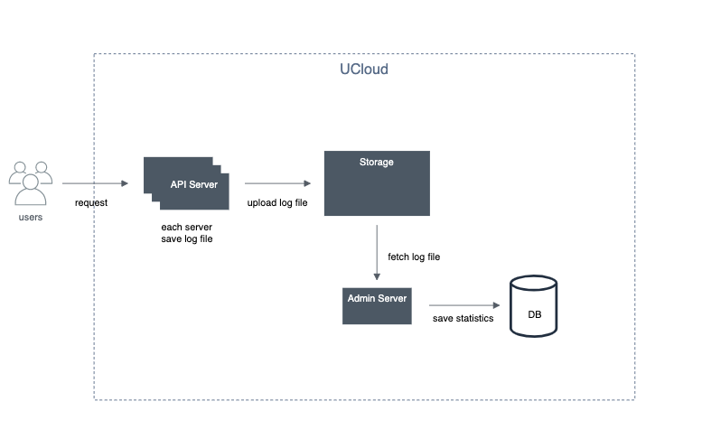
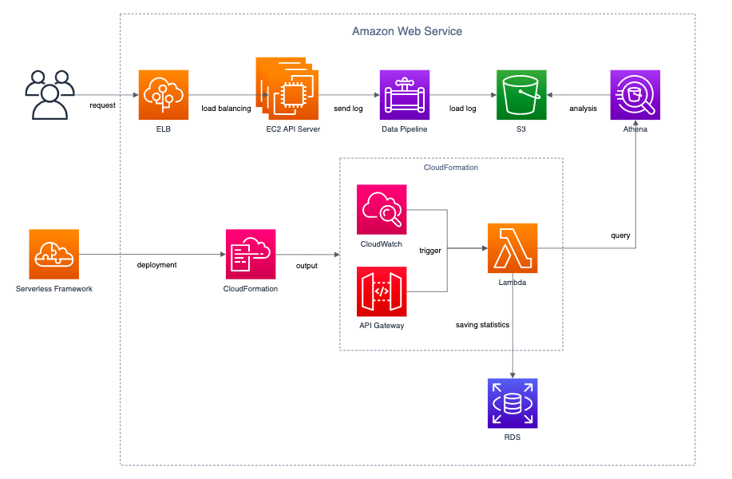

# Main Stack Technology
* AWS Lambda
* AWS Athena
* Serverless Framework
* Node.js

# Summary
상품조회 로그 수집 및 통계값 추출을 위해 Crontab 으로 실행되던 기존 배치 프로그램을 AWS Lambda 로 이전

# Problem Situation
#### 로드밸런싱 되고 있는 API 서버에 각각 상품조회 로그가 저장되는 중
> 로그 파일 관리가 어려움 
> API 서버가 Scale-In 되면 로그 파일 유실됨

#### API 서버마다 유클라우드 스토리지로 로그 파일 전송하는 배치 프로그램 실행
>  배치 프로그램 관리가 어려움

#### 통계 추출을 위해 관리자 서버에서 3개의 배치프로그램 실행
> 단순 통계 저장을 위해 3개의 배치프로그램이 돌고 있어 로직 파악이 어려움 
> 복잡한 로직으로 인해 통계 저장에 시간이 오래 걸림

# Improvement
#### 로드밸런싱 되고 있는 API 서버에 각각 상품조회 로그가 저장되는 중
> 로그 파일을 AWS S3에 저장

#### API 서버마다 유클라우드 스토리지로 로그 파일 전송하는 배치 프로그램 실행
> 배치 프로그램 AWS Lambda 로 이전

#### 통계 추출을 위해 관리자 서버에서 3개의 배치프로그램 실행
> Node.js 를 통한 로직 개선 및 비동기 작업으로 시간 단축

# Before Architecture
> 

# After Architecture
> 

# Progress
#### API 로그 엔드포인트 변경
> 이미 구축되어 있는 Data Pipeline 에 연결 
> S3에 연/월/일 별로 구분되어 적재됨

#### AWS Athena 를 통한 통계 데이터 추출
> 데이터 스캔비용 감소를 위해 연/월/일 별로 테이블 파티셔닝 
> 통계 데이터 추출용 쿼리 작성

#### 소스코드 관리를 위한 Serverless Framework 사용
> AWS Lambda Function Handler 작성
>> Node.js 사용 (자료 많음, 비동기 I/O)

> AWS CloudWatch 연동
>> 매일 정해진 시간에 이벤트 호출

> AWS API Gateway 연동
>> 시간에 상관 없이 Lambda Function 호출

